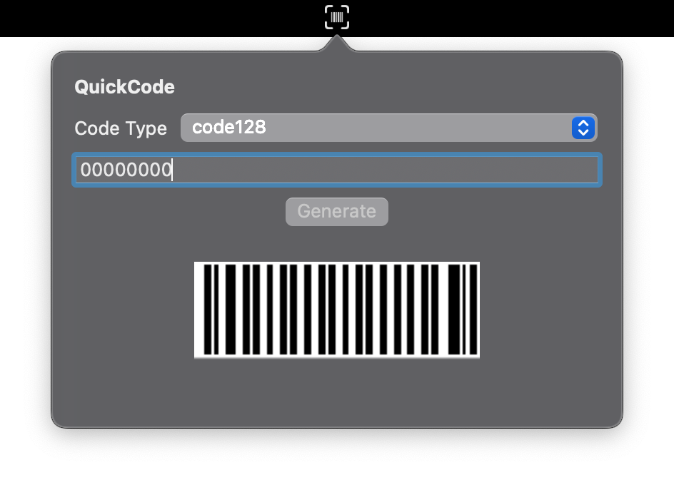

# QuickCode
This macOS menu app lets you quickly generate common types of barcodes.

## Installation
1. Make sure you have at least Xcode 12.1 installed on your computer
2. Run `make install` to add the app to your Applications folder